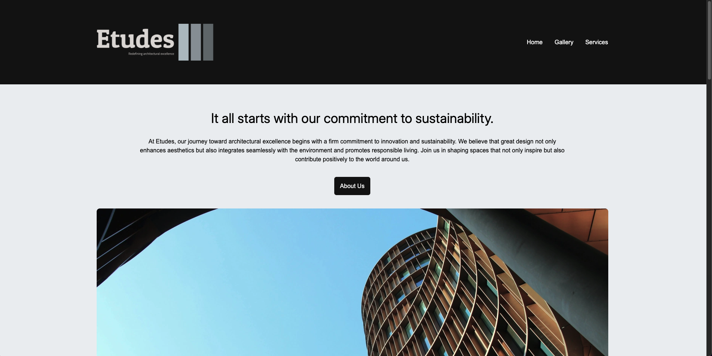
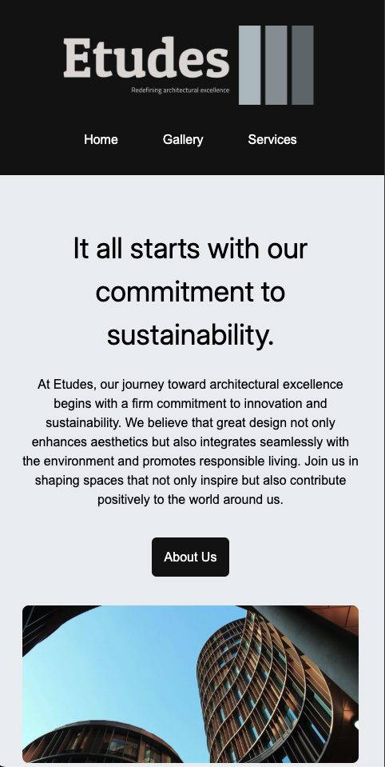

# Responsive-2-page-website
A mobile-first, responsive website built with HTML5 and CSS3. Developed as part of my NAIT web development coursework, it features breakpoints for mobile, tablet, and desktop layouts.

## 🖼️ Screenshots

| Desktop View | Mobile View |
|--------------|-------------|
|  |  |

## 🚀 Live Demo
[View on GitHub Pages](https://tsohnle95.github.io/responsive-2-page-website/) 

## 🔧 Technologies Used
- HTML5
- CSS3
- Media Queries (Mobile-First)

## 📄 Pages 
- Home Page
- Gallery Page

## ✨ Features
- Responsive layout with breakpoints for mobile, tablet, and desktop
- Clean, semantic HTML structure
- Organized CSS using mobile-first approach

## 🧠 What I Learned
- How to build responsive designs using CSS media queries
- Structuring multi-page websites
- Mobile-first development best practices

  ## 📝 Credits

Built based on a provided Figma design reference.

